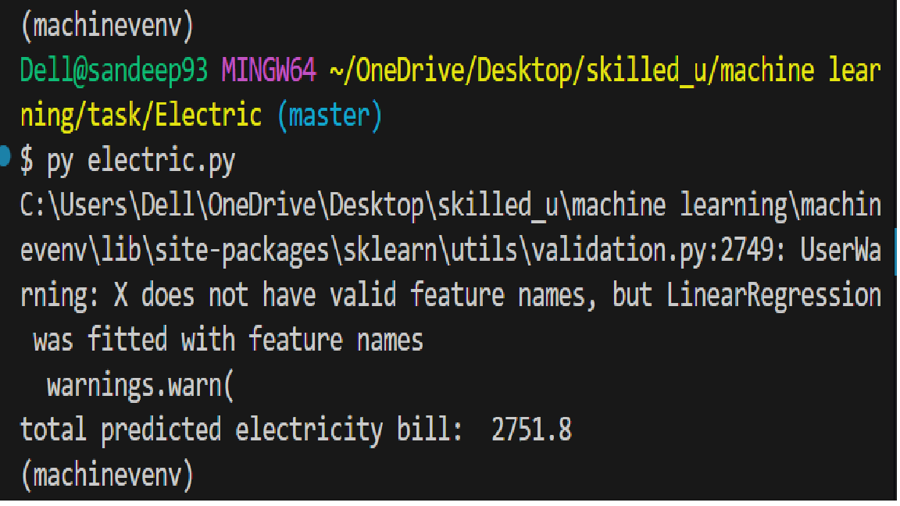

Electricity Bill Prediction using Linear Regression

This project uses Linear Regression (Machine Learning) to predict the monthly electricity bill based on appliance usage and total units consumed.

## Problem Statement

Predict the Monthly Electricity Bill using:

AC usage (hours/days)

Units of electricity consumed

## Dataset (bill.csv)

The CSV file should contain the following columns:

Column Name	Description
AC_Usage	    AC usage (hours or count)
UnitsConsumed	Total electricity units
MonthlyBill	    Electricity bill amount

## Technologies Used

Python 

Pandas

Scikit-learn

Linear Regression

## How the Model Works

Load dataset from bill.csv

Select features (AC_Usage, UnitsConsumed)

Train a Linear Regression model

Predict monthly electricity bill for new input values

# Example Prediction
bill = reg.predict([[9,350]])
print("total predicted electricity bill:", round(bill[0], 2))

Input Meaning:
[AC_Usage, UnitsConsumed]
[9, 350]

Output:
total predicted electricity bill: 2751.08

(Exact value depends on dataset)

# How to Run the Project
1 Install required libraries
pip install pandas scikit-learn

2 Run the Python file
python electric.py

## Author

Sandeep Aanjana

