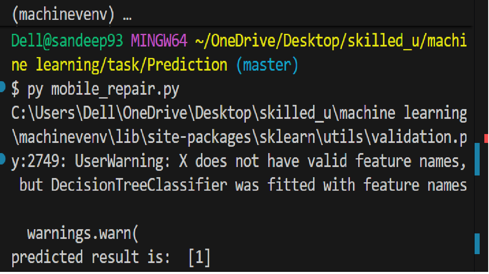

Phone Repair or Replace Prediction using Decision Tree

This project uses a Decision Tree Classifier to decide whether a mobile phone should be repaired or replaced based on:

Phone Age

Repair Cost

Brand Type

The output is:

Decision: Repair / Replace

## Dataset Requirements (repair.csv)

The CSV file must contain the following columns:
Column Name	Description	Values

Phone_Age	 Age of phone	        New / Old
Repair_Cost	 Cost of repair	        Low / High
Brand_Type	 Phone brand category	Premium / Normal
Decision	 Final outcome	        Repair / Replace

## Encoding Used

Categorical values are converted into numbers:

# Repair_Cost

Low → 0

High → 1

# Phone_Age

New → 1

Old → 0

# Brand_Type

Premium → 1

Normal → 0

# Decision

Repair → 1

Replace → 0

## Requirements

Install required libraries:

pip install pandas scikit-learn

# How to Run

1. Place repair.csv in the same folder as the Python script

2. Run the program:

python mobile_repair.py

3. Example output:

predicted result is:  [1]

1 = Repair
0 = Replace

# Prediction Example

The following input is used in the code:

dtree.predict([[2, 1, 1]])

Which means:

Phone_Age = New

Repair_Cost = High

Brand_Type = Premium

# Model Information

Algorithm: Decision Tree Classifier

Library: scikit-learn

## Author

Sandeep Aanjana

