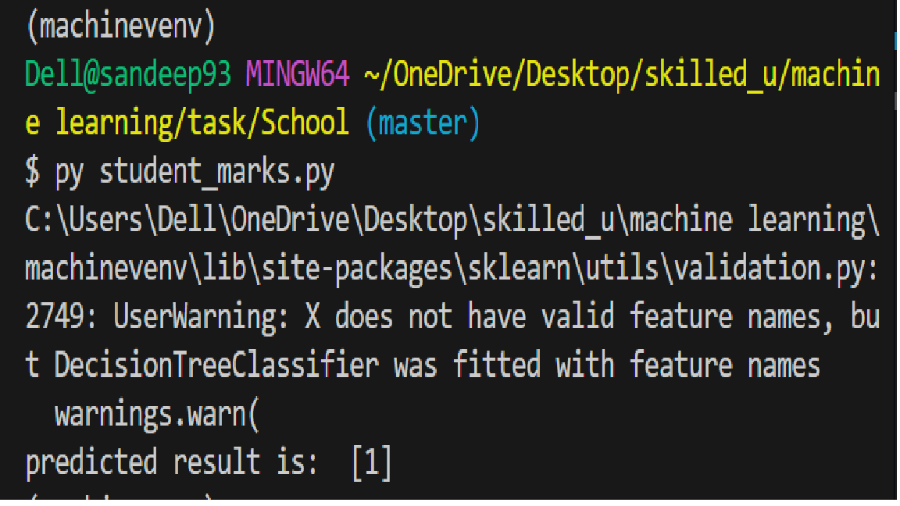

Student Final Result Prediction using Decision Tree

This project uses a Decision Tree Classifier to predict whether a student will pass or fail based on:

Attendance

Study Hours

Internal Test Result

The output is:

Final Result: Pass / Fail

## Dataset Requirements (school.csv)

The CSV file must contain the following columns:
Column Name	Description	Values

Attendance	            Attendance level	 Low / Medium / High
Study_Hours	Study time  category	         Low / Medium / High
Internal_Test_Result	Internal exam status  Pass / Fail
Final_Result	        Final outcome	      Pass / Fail

## Encoding Used

Categorical values are converted into numbers:

# Attendance

Low → 0

High → 1

Medium → 2

# Study_Hours

Low → 0

High → 1

Medium → 2

# Internal_Test_Result

Pass → 1

Fail → 0

# Final_Result

Pass → 1

Fail → 0

## Requirements

Install required libraries:

pip install pandas scikit-learn

# How to Run

1. Place school.csv in the same folder as the Python script

2. Run the program:

python student_marks.py

3. Example output:

predicted result is:  [1]

1 = Pass
0 = Fail

# Prediction Example

The following input is used in the code:

dtree.predict([[2, 1, 1]])

Which means:

Attendance = Medium

Study_Hours = High

Internal_Test_Result = Pass

# Model Information

Algorithm: Decision Tree Classifier

Library: scikit-learn

## Author

Sandeep Aanjana

