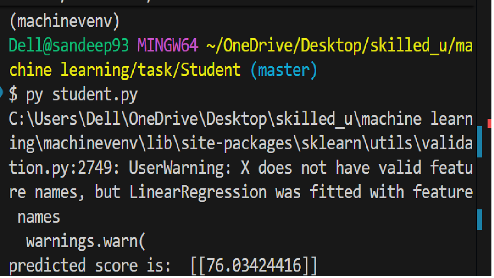

Student Final Marks Prediction using Linear Regression

This project uses Linear Regression from scikit-learn to predict a student’s final marks based on:

Study Hours

Pre-exam Marks

The output is:

Predicted Final Marks

## Dataset Requirements (student.csv)

The CSV file must contain the following columns:
Column Name	Description

StudyHr	    yearly   studyhours
PreexamMark	Marks in pre-exam
FinalMarks	Final exam score(target)

## Requirements

Install required libraries:

pip install pandas scikit-learn

# How to Run

1. Place student.csv in the same folder as the Python script

2. Run the program:

python student.py

3. Example output:

predicted score is:  [[78.45]]

(Actual value depends on training data.)

# Prediction Example

The following input is used in the code:

regr.predict([[4, 67]])

Which means:

Study Hours = 4

Pre-exam Marks = 67

# Model Information

Algorithm: Linear Regression

Library: scikit-learn

## Author

Sandeep Aanjana

