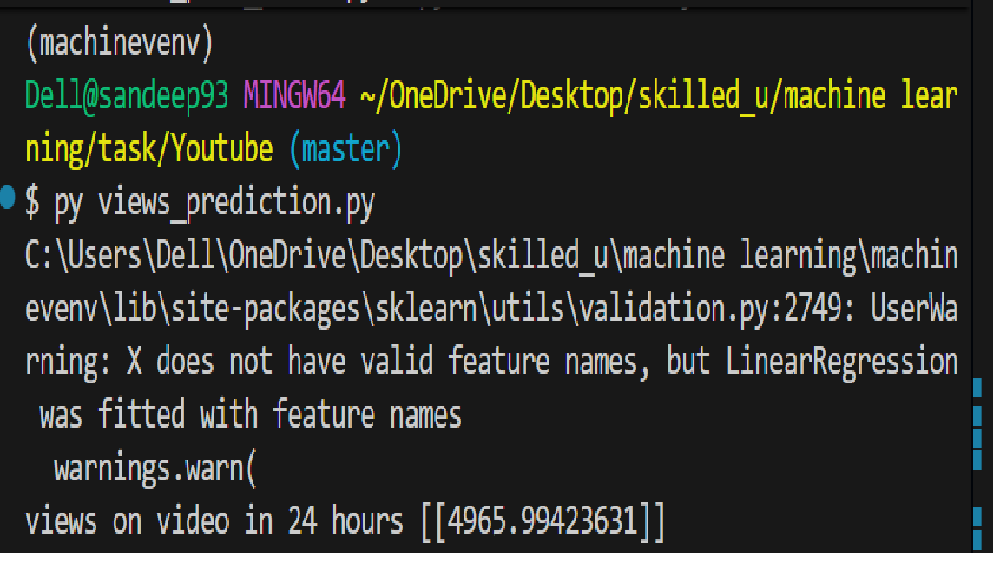

YouTube Video Views Prediction using Linear Regression

This project uses Linear Regression (Machine Learning) to predict the number of views a YouTube video will get in the first 24 hours based on content-related factors.

# Problem Statement

To predict Views in 24 Hours using:

Thumbnail quality

Posting time

# Dataset (youtube.csv)

The dataset should contain the following columns:

Column Name	Description
ThumbnailQuality	Quality score of thumbnail    numeric
PostingTime	        Time of posting               numeric/category encoded
Views24Hours	    Views in first 24 hours

## Technologies Used

Python 

Pandas

Scikit-learn

Linear Regression

## How the Model Works

Load dataset from youtube.csv

Select input features (ThumbnailQuality, PostingTime)

Train a Linear Regression model

Predict views for new video data

# Example Prediction
view = reg.predict([[7,4]])
print("views on video in 24 hours:", view)

Input Format:
[ThumbnailQuality, PostingTime]
[7, 4]

Output:
views on video in 24 hours: [[4965.99423631]]

(Exact value depends on the dataset)

## How to Run the Project
1. Install Required Libraries
pip install pandas scikit-learn

2. Run the Python File
python views_prediction.py

# Author

Sandeep Aanjana

