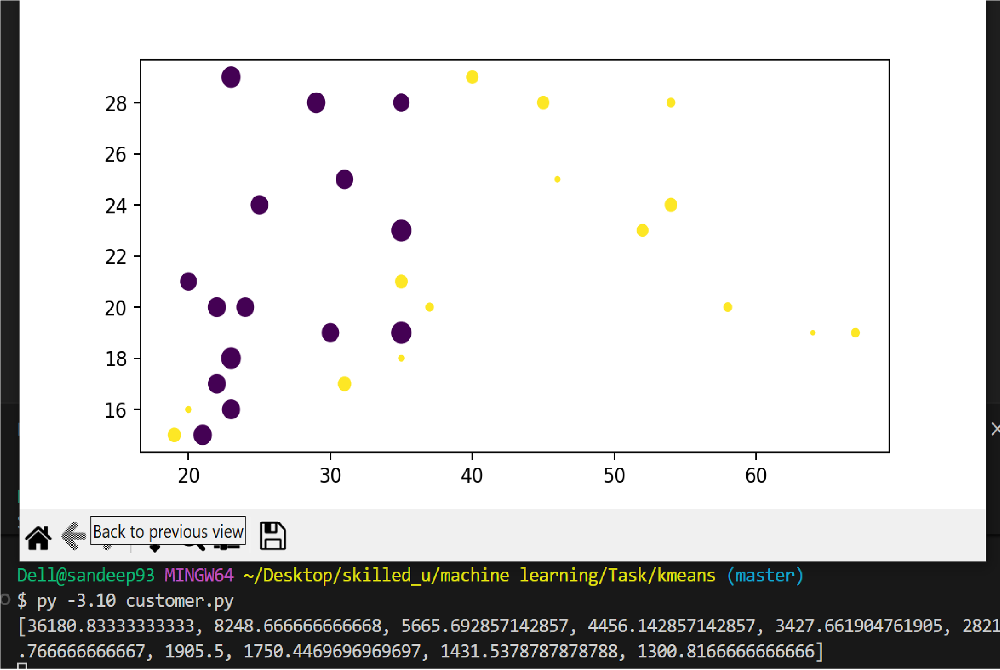

Customer Segmentation using K-Means Clustering (3D Visualization)
🔍 Project Description

Is project me hum K-Means Clustering algorithm ka use karke customers ko unki:

1. Age

2. Annual Income

3. Spending Score

ke basis par different groups (clusters) me divide karte hain.

Phir in clusters ko 3D graph ke through visualize kiya jata hai using Matplotlib.

📁 Dataset

File name: customerData.csv

Required columns:

Age

AnnualIncome(L)

SpendingScore

⚙️ Libraries Used

Make sure yeh libraries installed ho:

pip install pandas scikit-learn matplotlib

Python modules:

pandas

scikit-learn

matplotlib

mpl_toolkits.mplot3d

▶️ How the Code Works
1️⃣ Load Dataset

CSV file ko pandas dataframe me read kiya jata hai.

2️⃣ Feature Selection

Teen columns select kiye jaate hain:

Age → X-axis

Income → Y-axis

Spending Score → Z-axis

3️⃣ Preparing Data

Teeno columns ko combine karke ek list banai jaati hai:

(Age, Income, Score)

Ye K-Means model ko input diya jata hai.

4️⃣ Elbow Method (Optional)

Loop 1 se 10 clusters tak run hota hai aur har baar:

KMeans fit hota hai

Inertia calculate hoti hai

Isse best number of clusters choose kar sakte hain.

5️⃣ Train Final Model

2 clusters ke saath K-Means train kiya gaya:

n_clusters = 2

6️⃣ Visualization

3D scatter plot banaya jata hai jisme:

Har dot = ek customer

Different colors = different clusters

Axes labels bhi add kiye gaye hain.

📈 Output

3D graph with customer clusters

Visualization of spending behaviour

Customer segmentation for business insights

🎯 Use Cases

✔ Marketing Strategy
✔ Premium Customer Identification
✔ Discount Campaign Planning
✔ Customer Behaviour Analysis

👨‍💻 Author
Created by: Sandeep Aanjana

